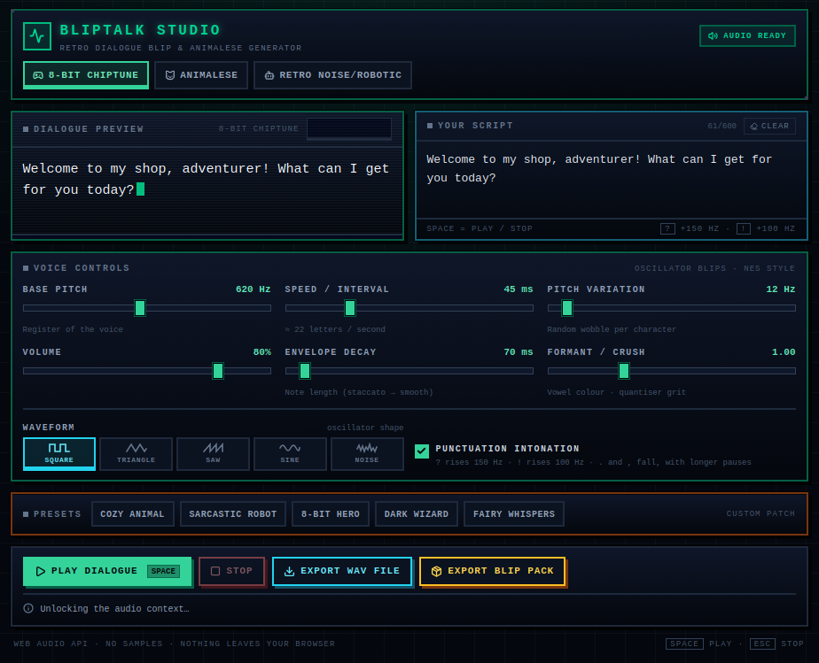

# BlipTalk Studio

**Turn typed text into retro dialogue sounds, right in your browser.**

BlipTalk Studio is a free tool for game makers who need a voice for their
characters without recording one. Type a line, pick a voice, press play, and
save the result as a WAV file you can drop into your game.

It runs entirely in your browser. The text you type is never uploaded anywhere.

---

## Play it now

<!-- TODO: paste the itch.io link here once the page is live -->

Open BlipTalk Studio and start typing.

---

## Make your first sound

1. **Type a line** into *Your Script*, or keep the one that is already there.
2. **Pick a preset** from the bar near the bottom. Try **8-Bit Hero**.
3. **Press Play Dialogue**, or hit the **Spacebar**. The text types itself out
   in the preview box, one blip per character.
4. **Export WAV File** to save the sound, or **Export Blip Pack** if you want
   individual blips to trigger from your game code.

Everything after this section is optional.

---

## The three voices

Switch tabs at the top to hear the same line in each one.

| Voice | What it sounds like | Good for |
| --- | --- | --- |
| **8-Bit Chiptune** | Classic NES or Game Boy bleeps. One short, pitched tone per character. | RPG text boxes, retro menus, arcade games. The *Undertale* or *Pokémon* feel. |
| **Animalese** | Fast chatter that copies the rhythm of speech. Every letter is a short syllable with a small tick in front of it. | Cute and life-sim characters. The *Animal Crossing* feel. |
| **Retro Noise/Robotic** | Buzzy, crunchy and metallic, like a voice coming through a broken speaker. | Robots, computers, radios, villains, announcements. |

These are not real text-to-speech, so you will not get understandable words.
They are the short voice blips games play while dialogue types onto the screen.

---

## The controls

You can ignore all of these and still get a usable sound. Here is what each one
does.

| Control | What it does | Try this |
| --- | --- | --- |
| **Base Pitch** | How high or low the voice sits. In Animalese it changes the voice completely, from a growly bear to a squeaky fairy. | 120–250 Hz for big monsters, 500–700 Hz for heroes, 900 Hz and up for tiny creatures. |
| **Speed / Interval** | How long each character lasts, in milliseconds. Lower is faster. | 30–45 ms is brisk, 60–80 ms is relaxed, 100 ms and up is slow and dramatic. |
| **Pitch Variation** | How much the pitch wanders from one character to the next. At 0 the voice is flat and machine-like. Higher values sound more alive. | 10–20 Hz for a steady hero, 40–70 Hz for a chatty character, 150 Hz and up for panic. |
| **Volume** | Output level, for both playback and exports. | Leave it near 80% and set the final volume in your game. |
| **Envelope Decay** | How long each blip rings on for, in milliseconds. Short is crisp, long is smooth and blended. | 40–80 ms for crisp retro blips, 200–400 ms for a spooky, echoing voice. |
| **Formant / Crush** | Changes the tone. In Animalese it makes the vowel sound deeper or brighter. In Robotic it sets how harsh the distortion is. | 0.7 for deep and muffled, 1.0 for neutral, 1.6 and up for bright and thin. |
| **Waveform** | The shape of the tone: Square, Triangle, Saw, Sine or Noise. In Animalese it changes how bright the vowels sound. | Square for classic 8-bit, Triangle or Sine for soft, Saw for harsh, Noise for static. |
| **Punctuation Intonation** | When on, `?` rises 150 Hz, `!` rises 100 Hz, and `.` and `,` fall slightly, with a longer pause after each. | Keep it on for dialogue. Turn it off for menu ticks and robotic voices. |

Two of these only apply to certain voices:

- **Envelope Decay** does nothing in Animalese. There, blip length follows
  **Speed** instead.
- **Formant / Crush** does nothing in 8-Bit Chiptune. In Animalese it changes
  the vowel sound, and in Robotic it changes the distortion.

---

## Presets

Each preset sets every slider at once and switches to the matching voice. Once
you move a slider the bar reads *custom patch*, so a preset will not overwrite
your edits.

| Preset | Voice | Character |
| --- | --- | --- |
| **Cozy Animal** | Animalese | Warm, mid-pitched, friendly. The shopkeeper. |
| **Sarcastic Robot** | Robotic | Low, slow, distorted. Deadpan. |
| **8-Bit Hero** | Chiptune | Bright, fast, crisp. The classic RPG protagonist. |
| **Dark Wizard** | Chiptune | Very low and slow, with harsh, long-ringing notes. |
| **Fairy Whispers** | Animalese | Very high, very fast, soft. Small and magical. |

---

## Saving your sounds

### Export WAV File

Downloads **`dialogue_blip.wav`**: the line you just heard, as a standard mono
WAV file. It works in Unity, Godot, GameMaker, RPG Maker and anything else that
plays WAV.

The file includes the pauses that punctuation creates, so it lines up with the
text typing on screen. For a tighter file, turn **Punctuation Intonation** off
and export again.

The same line with the same settings always produces the same file, so you can
re-export without the sound changing underneath you.

### Export Blip Pack

Downloads five WAV files, one per character, for triggering blips from your own
code as text types out. Which five you get depends on the voice:

| Voice | The five files |
| --- | --- |
| 8-Bit Chiptune / Robotic | A five-note scale: `blip_1_root`, `blip_2_second`, `blip_3_third`, `blip_4_fifth`, `blip_5_sixth`. Play them in order for a rising menu cursor, or use just the root for typing. |
| Animalese | The five vowel sounds: `blip_1_a`, `blip_2_e`, `blip_3_i`, `blip_4_o`, `blip_5_u`. Play one per character for a simple Animalese effect in your engine. |

Your browser will probably ask permission to download multiple files the first
time. Allow it and all five will arrive.

### Using the sounds in your game

Use them in anything you like, including commercial games. No credit needed.

---

## Recipes

Load a preset, then change the slider listed.

- **Friendly shopkeeper**: *Cozy Animal*, Pitch Variation up to about 35 Hz.
- **Retro RPG hero**: *8-Bit Hero*, no changes needed.
- **Terrifying final boss**: *Dark Wizard*, drop Base Pitch to about 120 Hz and
  raise Envelope Decay to about 400 ms.
- **Broken robot**: *Sarcastic Robot*, pull Formant/Crush down to about 0.5.
- **Menu cursor ticks**: 8-Bit Chiptune, Speed about 20 ms, Envelope Decay
  about 40 ms. Then Export Blip Pack and play one blip per cursor move.
- **Calm narrator**: Triangle waveform, Pitch Variation 0, Envelope Decay
  about 200 ms, Speed about 70 ms.
- **Panicking character**: Pitch Variation 150–200 Hz, Speed about 25 ms.

---

## Keyboard shortcuts

| Key | Action |
| --- | --- |
| `Space` | Play or stop the line. Ignored while you are typing in the text box. |
| `Esc` | Stop. |

---

## Common questions

**I pressed Play but there is no sound.**
Browsers block audio until you interact with the page. Click anywhere on the
page once, then press Play again. The badge in the top-right corner changes
from *Click to enable audio* to *Audio ready* when it works.

**Only one file downloaded from the blip pack.**
Your browser asks permission before allowing multiple downloads. Allow it, then
click Export Blip Pack again.

**The exported file sounds wrong or too quiet.**
Check the Volume slider first, since it applies to exports as well as playback.
Then make sure the sliders match what you were listening to.

**Why is the text limited to 600 characters?**
It is built for single lines of dialogue, not paragraphs. Short lines also
export faster.

**Is my text uploaded anywhere?**
No. Everything is generated inside your browser, and the app works offline once
the page has loaded.

**Which browsers work?**
Chrome, Edge, Firefox and Safari. Anything from the last few years should work.
On iPhone and iPad you have to tap the page once before sound will play.

**Can I use this in a commercial game?**
Yes. The tool is free and the sounds you make with it are yours.

---

## License

MIT.
